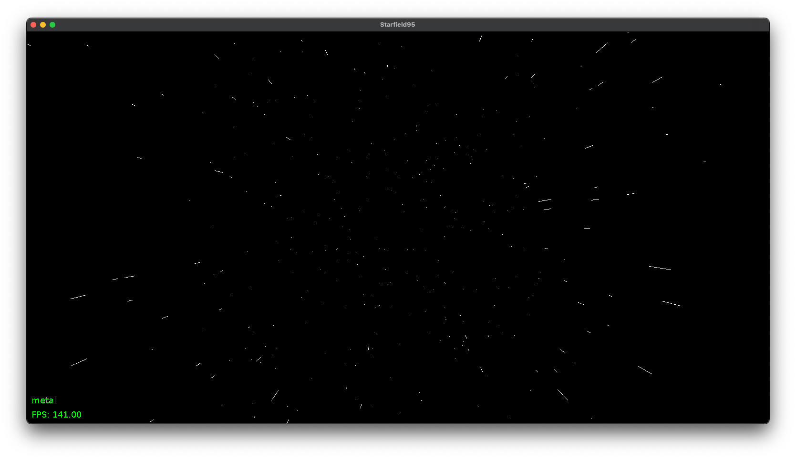

# Starfield95

Starfield95 is a recreation of the classic Windows 95 starfield screensaver, reimplemented in C using SDL2. 

This project brings back the nostalgic starfield effect with modern rendering techniques.



## Features
- Realistic star movement with perspective scaling
- Trail effects for nearby stars
- Adjustable star speed and count
- Modern UI using Nuklear immediate mode GUI
- Clean, styled overlay showing FPS and renderer information
- Resizable window with automatic star repositioning

## Build Instructions (Nix)

This project uses Nix for building and running. To build and run the project, use the following command:

```bash
nix run path:.
```

## Build Instructions (Non-Nix)

To build the project without Nix, ensure you have the following dependencies installed:
- pkg-config
- SDL2

Follow these steps:
1. Run `CC="yourCompilerOfChoice" make` to compile the project.
2. Execute `./starfield95` to run the program.

## Controls

- **ESC**: Quit the application

## Third-Party Libraries

This project uses the following third-party libraries:

- **SDL2**: Simple DirectMedia Layer (https://www.libsdl.org)
- **Nuklear**: Immediate mode GUI library (https://github.com/Immediate-Mode-UI/Nuklear)
  - Used for rendering the UI overlay
  - Available under MIT License
  - Included in repository (nuklear.h, nuklear_sdl_renderer.h)

## License

This project is licensed under the MIT License. See the [LICENSE](LICENSE) file for details.

### Third-Party Licenses

Nuklear is licensed under MIT License:
```
Copyright (c) 2017 Micha Mettke

Permission is hereby granted, free of charge, to any person obtaining a copy of
this software and associated documentation files (the "Software"), to deal in
the Software without restriction, including without limitation the rights to
use, copy, modify, merge, publish, distribute, sublicense, and/or sell copies
of the Software, and to permit persons to whom the Software is furnished to do
so, subject to the following conditions:

The above copyright notice and this permission notice shall be included in all
copies or substantial portions of the Software.

THE SOFTWARE IS PROVIDED "AS IS", WITHOUT WARRANTY OF ANY KIND, EXPRESS OR
IMPLIED, INCLUDING BUT NOT LIMITED TO THE WARRANTIES OF MERCHANTABILITY,
FITNESS FOR A PARTICULAR PURPOSE AND NONINFRINGEMENT. IN NO EVENT SHALL THE
AUTHORS OR COPYRIGHT HOLDERS BE LIABLE FOR ANY CLAIM, DAMAGES OR OTHER
LIABILITY, WHETHER IN AN ACTION OF CONTRACT, TORT OR OTHERWISE, ARISING FROM,
OUT OF OR IN CONNECTION WITH THE SOFTWARE OR THE USE OR OTHER DEALINGS IN THE
SOFTWARE.
